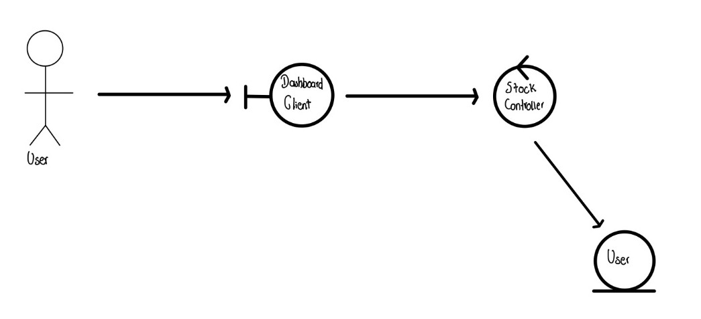
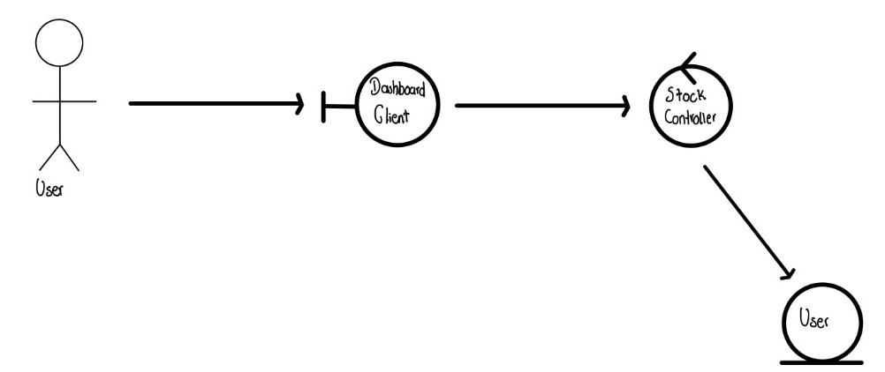

# Diagramas de Robustez - Stock Management

En esta sección se presentan los diagramas de robustez correspondientes al proyecto Stock Management. Estos diagramas ayudan a visualizar la interacción entre los actores y los objetos del futuro producto software.

## Lista de Diagramas

1. **Diagrama de Robustez 1**: Correspondiente a la Historia de Usuario 1, que permite entender el comportamiento de guardar acciones en el futuro producto software.
2. **Diagrama de Robustez 2**: Correspondiente a la Historia de Usuario 2, que permite entender el comportamiento de seguir el rendimiento de las acciones registradas anteriormente.
3. **Diagrama de Robustez 3**: Correspondiente a la Historia de Usuario 3, que permite entender el comportamiento de ver una lista con las acciones registradas anteriormente en el formulario del futuro producto software.

## Diagrama de Robustez 1

## Diagrama de Robustez 2

## Diagrama de Robustez 3

